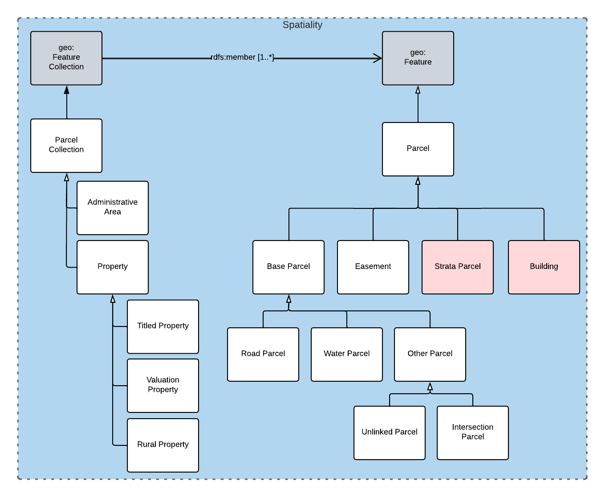

= SIQ Cadastre Model

***NOTE: This repository is for a project that is at an early stage of development so much of the content for this model does not exist yet. March, 2023***

This model is online at **https://linked.data.gov.au/def/cad**

This repository contains a data model for Cadastral information in Queensland. It is a system-independent model created using the https://www.w3.org/TR/owl2-primer/[Web Ontology Language (OWL)] that may be realised in any system that can meet its modelled elements.

This model is both a stand-alone model for cadastral information and also a _Component Model_ part of an integrative multi-model regime known as a _Supermodel_. The SIQ Supermodel aims to integrate cadastre, address, place name and other information. For more information about the SIQ Supermodel, see the https://github.com/Spatial-Information-QLD/supermodel[Supermodel's temporary home]

== Cadastre Class Hierarchy

* `geo:FeatureCollection`
** `csdm:ParcelAggregate`
*** `cad:Property`
**** `cad:TitledProperty`
**** `cad:ValuationProperty`
**** `cad:RuralProperty`
* `geo:Feature`
** `csdm:Parcel`
*** `cad:BaseParcel`
**** `cad:LotParcel`
**** `cad:RoadParcel`
***** `cad:IntersectionParcel`
***** `cad:TransportRouteParcel`
**** `cad:WatercourseParcel`
**** `cad:InterstateParcel`
*** `cad:BuildingStrataParcel`
*** `cad:EasementParcel`
*** `cad:InterestParcel`

This class hierarchy is shown graphically in the figure below:

[id=fig-cadastre]
.The Cadastre Component Model

== Rights and License

Content generated by Spatial Information Queensland is copyright as follows:

&copy; The State of Queensland (Department of Resources) 2023

This information is available for reuse under the [Creative Commons 4.0 license](https://creativecommons.org/licenses/by/4.0/), see the [LICENSE](LICENSE) file for the deed.

Much of the vocabulary content here is copied from elsewhere and, where this has occurred, the vocabulary source is noted so that the source information licensing and rights may be discovered.

== Contacts

For more information about these vocabularies, contact:

**Spatial Information**  
GeoResources Division  
Department of Resources  
Queensland Government  
<CadastralAdminDataHelp@resources.qld.gov.au> 

For further information, please visit:

<https://www.resources.qld.gov.au/data-mapping>  
<https://qldspatial.information.qld.gov.au/>

For technical vocabulary implementation questions, contact:

**Nicholas Car**  
<nick@kurrawong.ai>  
_Contractor to Spatial Information Qld._
